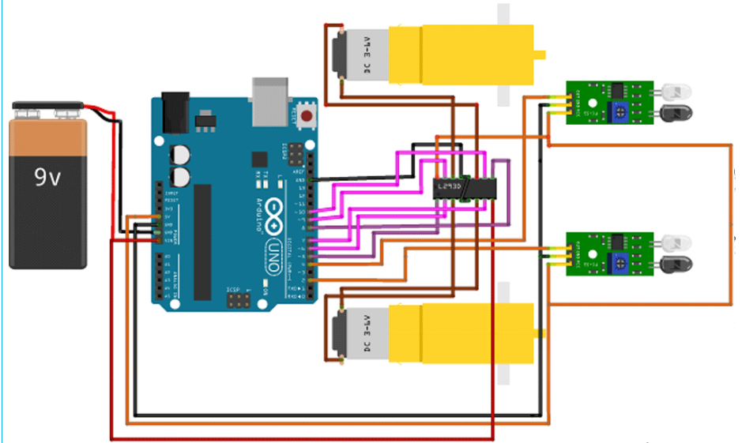
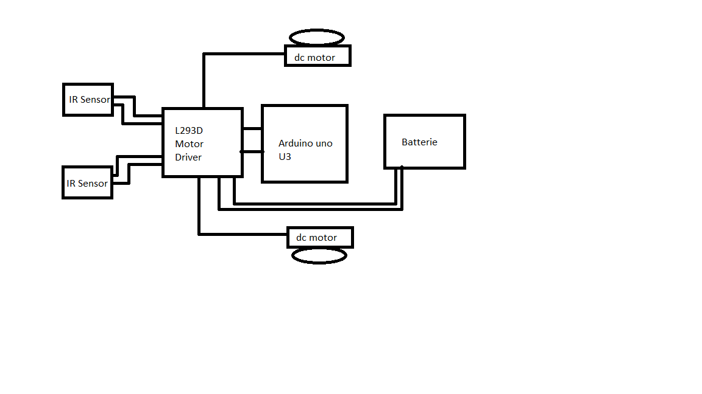

# Line Follower Robot

| | |
|-|-|
|`Author` | Samali Mohamed

## Description
This robot follows a black line drawn on a white background using line sensors.
## Motivation
Line follower robots are a popular project for hobbyists and educators because they are relatively easy to build and program. They are also a good way to learn about the basics of robotics.
## Architecture
The basic architecture of a line follower robot is as follows:

- Sensors: The robot uses sensors to detect the black line. The most common type of sensor for this application is an infrared (IR) sensor. IR sensors emit infrared light and then measure the amount of light that is reflected back from the surface. The robot can use this information to determine whether it is on the line or not.
- Motors: The robot uses motors to move itself around. The most common type of motor for this application is a DC motor. DC motors can be controlled by a microcontroller to rotate at a specific speed and direction.
- Microcontroller: The microcontroller is the brain of the robot. It takes the sensor data and uses it to control the motors. The microcontroller can also be programmed to perform other tasks, such as following a more complex path or avoiding obstacles.
### Block diagram

<!-- Make sure the path to the picture is correct -->

### Schematic

### Components

<!-- This is just an example, fill in with your actual components -->

| Device | Usage | Price |
|--------|--------|-------|
| Arduino Uno | This is a popular microcontroller board that is easy to use and affordable | [45 RON](https://www.robofun.ro/arduino-uno-r3-atmega328p-placa-de-dezvoltare-compatibila-cu-arduino-cablu-usb.html?gad_source=1&gclid=Cj0KCQjwxeyxBhC7ARIsAC7dS39-6_K5sSRKYcg_SPstpWJF-VHPIrO_BW8yhji8hq6laCEcAWCI_hUaAghQEALw_wcB) |
| IR sensors |  These are the sensors that the robot uses to detect the black line | [4.75 RON](https://www.sigmanortec.ro/Senzor-obstacol-IR-p125423458?gad_source=1&gclid=Cj0KCQjwxeyxBhC7ARIsAC7dS3-emMlUDBW4Tsj-zjQB8fpcg8ZEGDBcuoYug8dfnASn37PzN-THA3gaAhY1EALw_wcB) |
| BO motors | These are the motors that the robot uses to move itself around| [4 RON](https://www.sigmanortec.ro/Motor-DC-3-6V-p125923622?gad_source=1&gclid=Cj0KCQjwxeyxBhC7ARIsAC7dS3_MRiGK3Vy4MUoFEFl_jzJZ0arUwMk4PF2zh3segV32v5IYmlGnJMoaAsyLEALw_wcB) |
| Breadboard | Project board | [10 RON](https://www.optimusdigital.ro/ro/prototipare-breadboard-uri/8-breadboard-830-points.html?search_query=breadboard&results=145) |
| Chassis | This is the frame that holds all of the components of the robot together | [48 RON](https://www.sigmanortec.ro/Kit-Sasiu-Smart-Car-2WD-p141489122?gad_source=1&gclid=Cj0KCQjwxeyxBhC7ARIsAC7dS3-8X_k8Drn6ozoLtjq7_fZtoQWAezQazTo7GzfnXuA8EFM_ZEdmcW0aApqoEALw_wcB) |
| Battery |  This is the power source for the robot | [6 RON](https://www.emag.ro/search/9v+rechargeable+battery) |
| L293D motor driver | This is a motor driver that allows the Arduino to control two DC motors | [11.5 RON](https://ardushop.ro/ro/electronica/84-l298n-punte-h-dubla-dual-h-bridge-motor-dcsteppe.html?gad_source=1&gclid=Cj0KCQjwxeyxBhC7ARIsAC7dS3_a9xAjqR7axeDUlBj5J8NyneQJxdy6NtBsUyJTD9O3Izl7jPZoq3IaAvBsEALw_wcB) |
| Wheels | These are the wheels that the robot uses to roll around 

### Libraries

<!-- This is just an example, fill in the table with your actual components -->

| Library | Description | Usage |
|---------|-------------|-------|
| [lib-name1](link-to-lib) | official description of the lib | Used for accesing the peripherals of the microcontroller  |
| [lib-name2](link-to-lib) | official description of the lib | Used for accesing the peripherals of the microcontroller  |

## Log

<!-- write every week your progress here -->

### Week 6 - 12 May

### Week 7 - 19 May

### Week 20 - 26 May

## Reference links

<!-- Fill in with appropriate links and link titles -->

[Tutorial 1](https://www.youtube.com/watch?v=wdgULBpRoXk&t=1s&ab_channel=BenEater)

[Article 1](https://www.explainthatstuff.com/induction-motors.html)

[Link title](https://projecthub.arduino.cc/)
